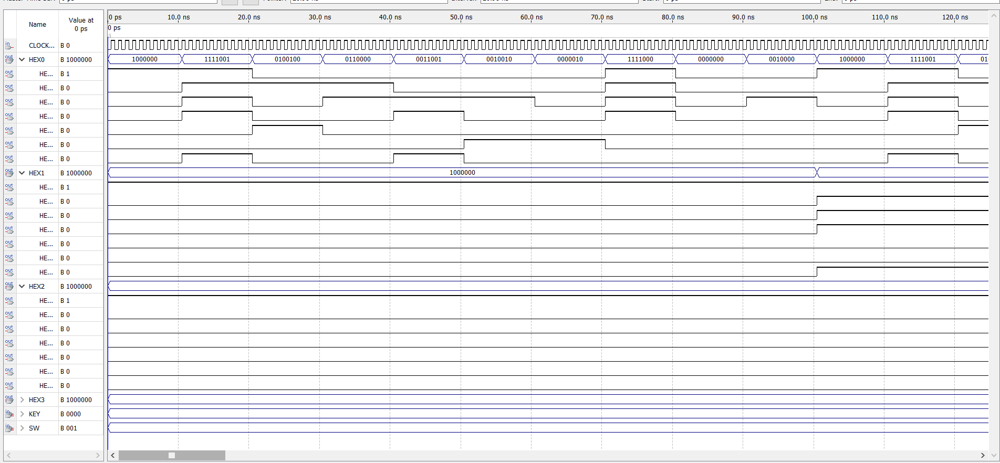

# EEE339-Assignment1
This is the EEE339 assignment 1 Verilog personal implementation.

# Assignment 1 Report

## Design objectives and function description. 

This design is used to construct a timer and a clock. Both of them contains 4 digits. The four digits of timer is "minute : second/10 : second/1 : tenth of a second". And the dour digits of clock is "minute/10 : minute/10 : second/10 : second/1". Both of them should not interfere with each other during operation. One of them should be work properly while the other is displaying number. The timer display could be reset. Both of them could be set time by buttons. 

## The definitions for the switches and buttons are provided.

There are three switches total. The followings are functional description respective.

1. Choose modes. The timer or the clock.
2. Control start or stop.
3. Clear timer. 

And four buttons are used to set four time count respectively. Each click will increase the count by one until it is carried. Triggering the carry will make the indication of this digit zero and next digit increase by one. 

Button only be effective when the timer is stop.  


## System overview and a diagram 


## My synthesized circuit 

The output circuit of quartus.


The circuit is not separated into several part because it is as the task to instead of module. I divided the four time digits into `task`.  And the display number to `HEX` is also a `task`. 

In this design, the number of each time bit and CLOCK is in the `always@` block.


## Simulation the core components 

Because the simulation cannot have 50M clock, the logic of clock should be change to 0.1 second per clock cycle. The original logic is 0.1 second per 5M clock cycle.

### The simulation of timer

Set the clock is 10ns.


The output of HEX0 and HEX1 is the last two digit of display. The value of hex is obey the display order.


### The simulation of clock



Set the clock is 1ns. Because if the clock cycle is not enough, the operation of carry will not apparent. As the figure shown, the circuit is work property.

## Appendix Verilog code

```verilog
module ass1 (CLOCK_50, KEY[3:0], SW[2:0], HEX0, HEX1, HEX2, HEX3);
    input CLOCK_50;
	input [3:0] KEY;
	input [2:0] SW;
	output reg [6:0] HEX0;
	output reg [6:0] HEX1;
	output reg [6:0] HEX2;
	output reg [6:0] HEX3;
    // minutes
    integer min=0;
    // ten seconds
    integer sec10=0;
    // one seconds
    integer sec1=0;
    // one/ten seconds
    integer sec01=0;
    integer counter_timer=0;
    // carry_out array
    reg [0:4] w;
    // boot switch
    assign mode=SW[0]; 
    // count switch
    assign is_count=SW[1];

    // variables for clock
    integer m10=0;
    integer m01=0;
    integer s10=0;
    integer s01=0;
    reg [0:4] c;
    integer counter_clock=0;

    integer b0;
    integer b1;
    integer b2;
    integer b3;

	reg [1:0] key_status3=2'b11;
	reg [1:0] key_status2=2'b11;
	reg [1:0] key_status1=2'b11;
	reg [1:0] key_status0=2'b11;

    always @(posedge CLOCK_50) begin
        counter_clock = counter_clock + 1;
        counter_timer = counter_timer + 1;
        if (mode==0) begin
            key_status3[1:0]={key_status3[0],KEY[3]};
            set_time(key_status0 [1:0], 5, sec01);
            
            key_status2[1:0]={key_status2[0],KEY[2]};
            set_time(key_status1 [1:0], 9, sec1);
            
            key_status1[1:0]={key_status1[0],KEY[1]};
            set_time(key_status2 [1:0], 5, sec10);
            
            key_status0[1:0]={key_status0[0],KEY[0]};
            set_time(key_status3 [1:0], 9, min);
            b0 = sec01;
            b1 = sec1;
            b2 = sec10;
            b3 = min;
        end else begin
            b0 = s01;
            b1 = s10;
            b2 = m01;
            b3 = m10;
        end
        if (counter_timer>=5000000) begin // 5M
            if(is_count==1) begin
                time_bit(10, w[4], sec01, w[0]);
                time_bit(10, w[0], sec1, w[1]);
                time_bit(6, w[1], sec10, w[2]);
                time_bit(10, w[2], min, w[3]);
                counter_timer = 0;
                w[4] = 1;
            end 
        end
        if(counter_clock>=50000000) begin // 50M
            time_bit(10, c[4], s01, c[0]);
            time_bit(6, c[0], s10, c[1]);
            time_bit(10, c[1], m01, c[2]);
            time_bit(6, c[2], m10, c[3]);
            counter_clock = 0;
            c[4] = 1;
        end 

        if(SW[2]==1)begin
            sec01 = 0;
            sec1  = 0;
            sec10 = 0;
            min   = 0;
        end
    end

    always @(*) begin
        HEX0 = num_to_hex(b0);
        HEX1 = num_to_hex(b1);
        HEX2 = num_to_hex(b2);
        HEX3 = num_to_hex(b3);
    end

	task set_time;
		input reg [1:0] key_status;
		input integer up_limit;
		inout integer clk_bit;
		
		if(key_status[1:0]==2'b01)
			begin
				if(clk_bit==up_limit)
					clk_bit=0;
				else
					clk_bit=clk_bit+1;
			end
	endtask
    
    task time_bit;
        input integer up_limit;
        inout carry_in;
        inout integer s;
        output carry_out;

        if (carry_in == 1) 
        begin
            s = s + 1;
            carry_in = 0;
            if (s == up_limit) begin
                carry_out = 1;
                s = 0;
            end
        end
    endtask

	function [6:0] num_to_hex;
		input integer number;
            case(number)
            0: num_to_hex = 7'b1000000;
            1: num_to_hex = 7'b1111001;
            2: num_to_hex = 7'b0100100;
            3: num_to_hex = 7'b0110000;
            4: num_to_hex = 7'b0011001;
            5: num_to_hex = 7'b0010010;
            6: num_to_hex = 7'b0000010;
            7: num_to_hex = 7'b1111000;
            8: num_to_hex = 7'b0000000;
            9: num_to_hex = 7'b0010000;
            endcase
	endfunction
endmodule
```

